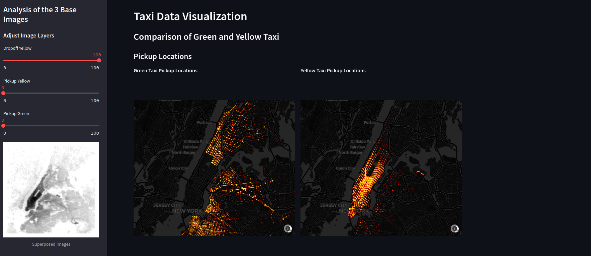
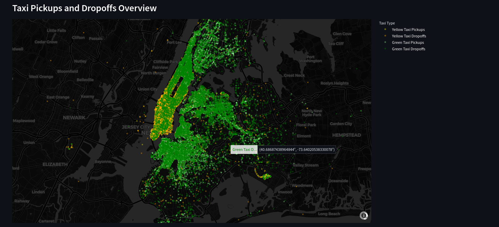
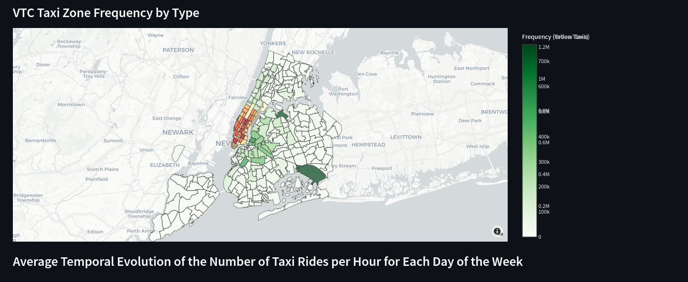
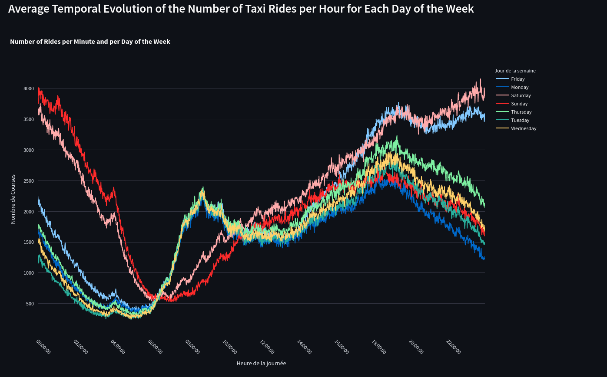
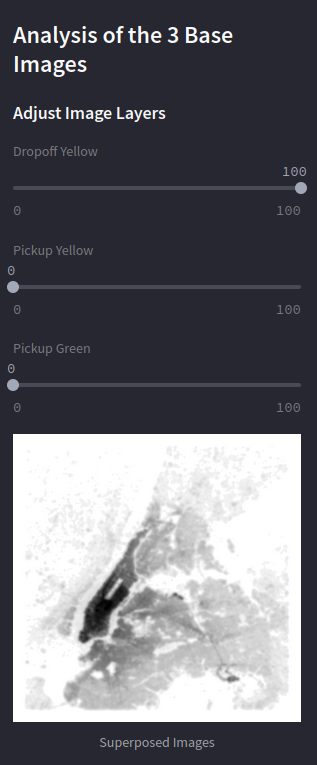

# Taxi Data Visualization

🚖 **Taxi Data Visualization** is an interactive Streamlit application designed for exploring and analyzing taxi pickup and dropoff data, along with temporal and spatial trends of taxi rides in New York City. This tool provides powerful insights into differences between Green and Yellow taxis, as well as ride-hailing services (VTCs), by leveraging various advanced visualization techniques.

---

## 📝 Features

1. **Pickup and Dropoff Zones Analysis with Datashader**:
    - High-density pickup and dropoff zones are emphasized using pixel intensity on interactive maps. These maps are dynamic, allowing zooming, panning, and resetting to default views using the "home" icon.
    - **Why Datashader?**
        - Datashader efficiently visualizes millions or even billions of data points by aggregating data based on screen resolution. It ensures high performance using NumPy and Dask, making it ideal for large datasets without overloading graphical resources.

    

2. **Global Taxi Map**:
    - A comprehensive map showcasing all pickup and dropoff data for both Green and Yellow taxis.
    - Highlights service areas for each type of taxi, allowing users to explore and interact with the map legends to filter specific data.

    

3. **Ride-Hailing (VTC) Pickup Zone Analysis**:
    - A vibrant visualization displaying activity levels across VTC zones.
    - Saturated colors represent high activity, while pale colors indicate lower activity.
    - Provides insights into VTC market share compared to traditional taxi services.

    

4. **Taxi Activity Trends by Hour and Day**:
    - A line chart summarizing average pickups for each day of the week in 2015.
    - Reveals distinct patterns:
        - **Weekdays**: Activity peaks during commute hours (morning and evening).
        - **Weekends**: Spread throughout the day, with significant nighttime activity (except for Sunday night, which tapers off).

    

5. **Image Layer Adjustment**:
    - Users can blend and adjust map layer opacity for a deeper exploration of spatial trends.

    

---

## 📂 Project Structure

```bash
├── app.py                  # Main application script
├── data/                   # Data folder containing CSV and GeoJSON files
│   ├── GreenDataResize.csv
│   ├── YellowDataResize.csv
│   ├── vtc_zone_freq.geojson
│   ├── YellowVTC_Zone_Freq.csv
│   ├── GreenVTC_Zone_Freq.csv
│   ├── grouped_by_minute.csv
├── images/                 # Processed images folder
│   ├── final_image_dropoff_yellow.png
│   ├── final_image_pickup_yellow.png
│   ├── final_image_pickup_green.png
├── .gitignore              # Ignored files for Git
├── README.md               # Project README file
├── requirements.txt        # Python dependencies
```

---

## 🚀 Deployment

This project is deployed on **Render**. You can access the live application using the following link:  
**[Taxi Data Visualization on Render](https://cabflownyc.onrender.com/)**

---

## 🌟 Local Installation

1. Clone this repository:

    ```bash
    git clone https://github.com/ilyesdjerfaf/CabFlowNYC.git
    cd CabFlowNYC
    ```

2. Install required Python dependencies:

    ```bash
    pip install -r requirements.txt
    ```

3. Run the application:

    ```bash
    streamlit run app.py
    ```

---

## 📊 Data Sources

- **Taxi Data**: Processed CSV files for Green and Yellow taxis, including pickup and dropoff details.
- **Spatial Data**: GeoJSON file for taxi zones and their frequencies.
- **Images**: High-resolution images illustrating NYC taxi trends.

---

## 🌟 Usage

- **Interactive Datashader Maps**:
  - Analyze high-density pickup and dropoff zones interactively.
  - Zoom and filter dynamically for detailed exploration.
- **Sidebar Tools**:
  - Blend and adjust map layers to visualize spatial overlaps and patterns.
- **Temporal Trends**:
  - Explore activity trends by hour and weekday for insightful temporal analysis.

---

## 🛠 Requirements

- Python 3.8+
- Streamlit
- Plotly
- Pandas
- Datashader
- PIL (Pillow)
- colorcet

---

## 📜 License

This project is not licensed yet.

---

## 🏗 Future Enhancements

- Real-time data integration for live updates.
- Extend the application to analyze taxi trends in other cities.
- Introduce advanced time-series models for better temporal forecasting.

---

## 📬 Contact

For any inquiries or suggestions, please contact:

- **Ilyes DJERFAF**: [ilyes.djerfaf@etu-upsaclay.fr]  
- **Armand BIDAULD**: [armand.bidauld@etu-upsaclay.fr]
